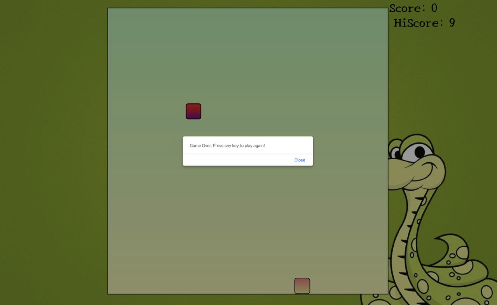
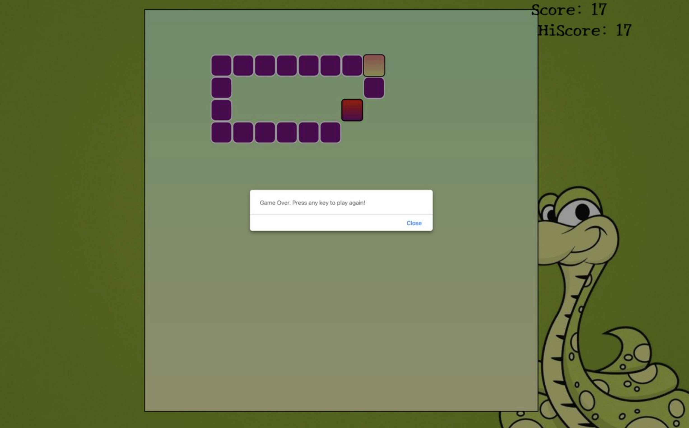

<p align="center"></p>
 
 <h1 align="center">SnakeGame</h1>

Welcome to snakegame , a project by [Charu](https://github.com/CH4RUU).

<h2 align="center">Website Link</h2>
https://ch4ruu.github.io/snakegamee/
<h2 align="center">Overview</h2>

Snake Game is a classic arcade game where players control a growing snake and navigate it to eat food while avoiding collisions. This project is built using modern web technologies and provides a fun, interactive gaming experience.

<h2 align="center">Project Structure</h2>

- **`index.html`**: The main landing page of the website.
- **`styles.css`**: Contains all the styling rules for the website.
- **`script.js`**: Handles the interactive functionalities and user interactions.


  <ul>
  <li><strong>Front-End:</strong>
    
    
    
  </li>
</ul>

<h2 align="center">Features</h2>

- **Classic Snake Gameplay** – Navigate the snake, eat food, and grow.
- **Collision Detection** – Game over when the snake hits the wall or itself.
- **Score Tracking** – Displays the current score and high score.
- **Responsive Design**: Optimized for various devices and screen sizes.
- **Intuitive UI** – Simple and clean interface for better user experience.
- [DEMO LINK](https://ch4ruu.github.io/snakegamee/)

<h2 align="center">Snippets</h2>

<div align="center">
  
  
  
</div>
## Getting Started

1. **Clone the Repository**:

   ```bash
   git clone https://github.com/CH4RUU/snakegamee.git

  
<h2 align="center">Contributing     </h2>

Contributions are welcome! Please fork the repository and submit a pull request for any enhancements or bug fixes.


